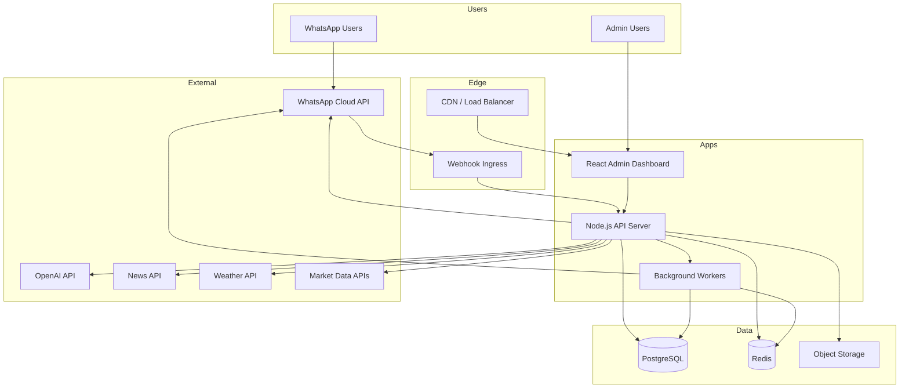
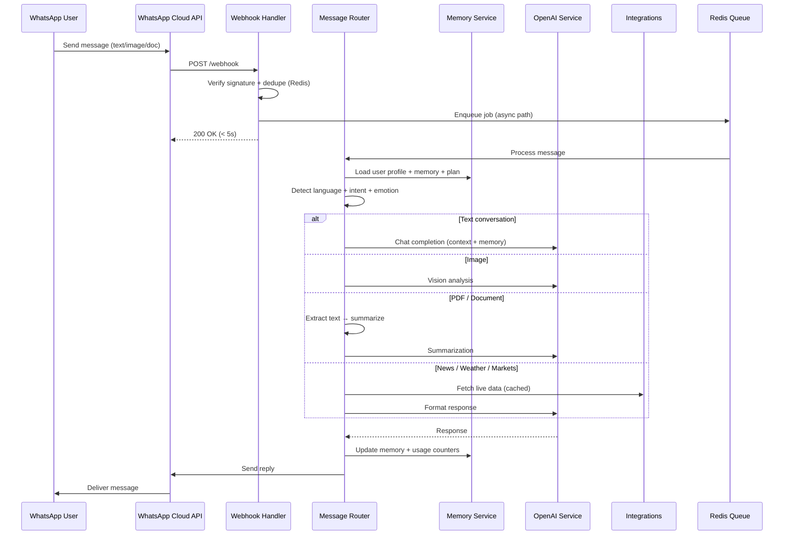
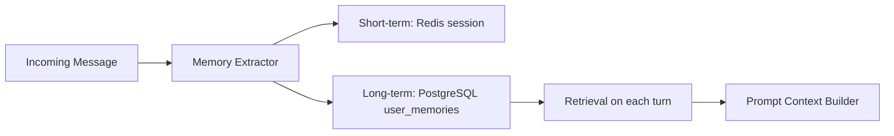
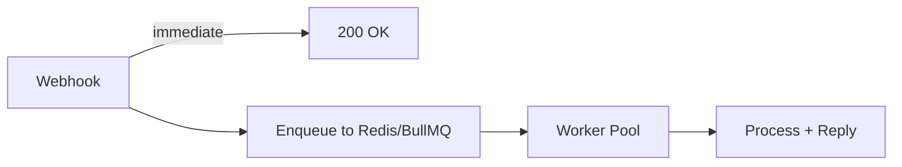
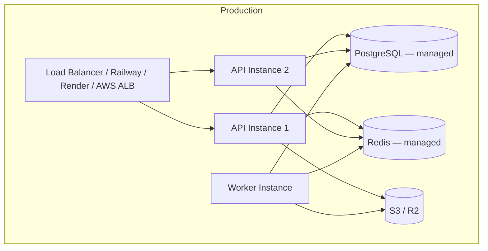

# Saaya AI — System Architecture Blueprint

> **Status:** Planning document · **Version:** 1.0 · **Stack:** Node.js · WhatsApp Cloud API · OpenAI · PostgreSQL · Redis · React

---

## 1. Executive Summary

Saaya AI is a **WhatsApp-native intelligent assistant** that supports Hindi, English, and additional languages. It combines conversational AI, multimodal analysis (images, PDFs, documents), real-time data integrations (news, weather, markets), emotional understanding, personalized memory, scheduled greetings, and business-assistant workflows — all managed through an **admin dashboard** with user management and subscription billing.

This document defines the **complete system architecture**, **folder structure**, and **phased development roadmap**. No implementation code is included.

---

## 2. Design Principles

| Principle | Description |
|-----------|-------------|
| **WhatsApp-first** | All user interactions happen via WhatsApp Cloud API; admin ops via React dashboard |
| **Fast by default** | Redis caching, async workers, streaming where possible, pre-warmed context |
| **Modular services** | Feature domains (memory, media, markets, greetings) are isolated modules behind a router |
| **Language-aware** | Detect language per message; respond in user's language; store locale preference |
| **Stateful but scalable** | PostgreSQL for durable state; Redis for sessions, cache, queues, rate limits |
| **Plan-gated features** | Subscription tier controls feature access, quotas, and rate limits |
| **Observable** | Structured logs, metrics, webhook replay, admin audit trail |

---

## 3. High-Level Architecture



---

## 4. Core Message Flow



---

## 5. Component Breakdown

### 5.1 Webhook & Ingress Layer

| Component | Responsibility |
|-----------|----------------|
| **Webhook Controller** | GET verification, POST message events, signature validation |
| **Event Normalizer** | Parse WhatsApp payloads into internal `InboundMessage` schema |
| **Deduplication** | Redis SET with TTL on `message_id` to prevent double processing |
| **Rate Limiter** | Per-user and global limits based on subscription plan |

### 5.2 Message Router (Orchestrator)

Central brain that:

1. Resolves user by WhatsApp phone number
2. Loads subscription plan + feature flags
3. Runs **language detection** (Hindi / English / other)
4. Runs **intent classification** (chat, image, pdf, news, weather, markets, business, greeting reply)
5. Runs **emotion detection** (sentiment: positive, neutral, negative, stressed, excited, etc.)
6. Dispatches to the correct **feature handler**
7. Applies **personalization layer** (name, preferences, tone, history)
8. Sends response via WhatsApp outbound service

### 5.3 AI Layer (OpenAI)

| Capability | OpenAI Usage |
|------------|--------------|
| General chat | `gpt-4o` or `gpt-4o-mini` (tier-based) |
| Hindi + English | System prompt + language detection; respond in detected language |
| Multi-language | Extend detection to `hi`, `en`, `mr`, `gu`, `ta`, etc. via prompt + optional detector library |
| Image analysis | Vision model on uploaded media |
| PDF / document summarization | Text extraction → chunk → summarize |
| Emotion understanding | Lightweight classification pass before main response; adjust tone |
| Business assistant | Structured prompts for invoices, reminders, meeting notes, email drafts |
| Personalized tone | Inject user memory + emotion context into system prompt |

**Context window strategy:**
- Last N messages from Redis session (hot)
- Long-term memory snippets from PostgreSQL (semantic retrieval later — Phase 4+)
- User profile facts (name, preferences, business info)

### 5.4 Memory System



| Memory Type | Storage | Examples |
|-------------|---------|----------|
| **Session context** | Redis (TTL 24h) | Last 10–20 turns |
| **User profile** | PostgreSQL `users` | Name, language, timezone |
| **Explicit facts** | PostgreSQL `user_memories` | "My name is Rahul", "I run a bakery" |
| **Preferences** | PostgreSQL `user_preferences` | Tone, greeting opt-in, business mode |
| **Usage history** | PostgreSQL `message_logs` | Audit, analytics, admin |

**Memory write triggers:**
- User says "mera naam …", "remember …", "yaad rakhna …"
- AI extracts structured facts post-response (background job)
- Admin override via dashboard

### 5.5 Media Processing

| Input | Pipeline |
|-------|----------|
| **Image** | Download from WhatsApp → store in S3 → OpenAI Vision → delete or retain per plan |
| **PDF** | Download → extract text (pdf-parse) → chunk if large → summarize |
| **DOCX** | Download → extract (mammoth/docx) → summarize |
| **Audio** (future) | Whisper transcription → chat |

All media jobs run in **background workers** to keep webhook response under 5 seconds.

### 5.6 Integration Services

| Service | Provider Options | Cache TTL |
|---------|------------------|-----------|
| **News** | NewsAPI, GNews, or custom RSS aggregator | 5–15 min |
| **Weather** | OpenWeatherMap, WeatherAPI | 15–30 min |
| **Gold / Silver** | Metals-API, GoldAPI | 1–5 min |
| **Crypto** | CoinGecko, CoinMarketCap | 1 min |
| **Stocks / Indices** | Alpha Vantage, Yahoo Finance (unofficial), NSE/BSE feeds | 1–5 min |
| **Commodities** | Commodities-API | 5 min |

Each integration:
- Has a dedicated module with fallback messaging
- Caches responses in Redis
- Logs failures; returns graceful Hindi/English fallback
- Is gated by subscription tier

### 5.7 Emotion Understanding

```
Message → Emotion Classifier (OpenAI mini call or rules + keywords)
       → Emotion tag: { joy, sadness, anger, anxiety, neutral, excitement }
       → Tone adapter adjusts response style
       → Optional: log emotion trends for admin analytics
```

Used for:
- Softer replies when user seems stressed
- Enthusiastic tone when user is excited
- Admin dashboard emotion trend charts (aggregated, anonymized)

### 5.8 Scheduled Greetings (Cron)

| Greeting | Trigger | Logic |
|----------|---------|-------|
| Good Morning | User's local 7:00–9:00 AM | Cron worker scans opted-in users by timezone |
| Good Afternoon | 12:00–2:00 PM | Personalized with name + optional tip |
| Good Night | 9:00–11:00 PM | Personalized, respects quiet hours |

**Implementation:**
- `node-cron` or BullMQ repeatable jobs
- `user_preferences.greeting_enabled`, `timezone`, `language`
- Template engine with AI optional personalization layer
- Redis lock to prevent duplicate sends

### 5.9 Business Assistant Module

Feature bundle for business users:

| Feature | Description |
|---------|-------------|
| Meeting summary | User sends notes → formatted summary |
| Invoice helper | Generate invoice text/template from inputs |
| Customer reply drafts | Professional Hindi/English replies |
| Reminders | "Remind me to call client at 4 PM" → scheduled WhatsApp message |
| Quick calculations | GST, margins, simple finance |
| Business profile | Store business name, GSTIN, services in memory |

Gated behind **Business** or **Pro** subscription tier.

### 5.10 Subscription & Billing

| Plan | Example Limits |
|------|----------------|
| **Free** | 20 messages/day, text only, basic Hindi/English |
| **Basic** | 100 messages/day, image analysis (5/day), news + weather |
| **Pro** | Unlimited chat, PDF (10/day), markets, emotion, greetings |
| **Business** | All Pro + business module, priority queue, admin support |

**Entities:** `plans`, `subscriptions`, `usage_counters`, `invoices` (future payment gateway)

Enforcement at router level before dispatching to paid features.

### 5.11 Admin Dashboard (React)

| Module | Capabilities |
|--------|--------------|
| **Auth** | Admin login (JWT), role-based access (superadmin, support, analyst) |
| **Dashboard** | DAU, messages/day, plan distribution, error rate, API latency |
| **Users** | Search, view profile, memory, message history, block/unblock |
| **Subscriptions** | Assign/change plans, override limits, trial management |
| **Broadcasts** | Send template messages to user segments (WhatsApp templates) |
| **Greetings config** | Enable/disable globally, edit templates |
| **Integrations** | API key management, cache flush, health status |
| **Logs** | Webhook logs, failed jobs, OpenAI usage |
| **Settings** | System prompts, feature flags, maintenance mode |

---

## 6. Data Architecture

### 6.1 PostgreSQL — Core Entities

```
users
├── id, phone (E.164), name, language, timezone
├── status (active, blocked, trial)
├── emotion_opt_in, greeting_opt_in
└── created_at, updated_at

user_memories
├── id, user_id, key, value, source (explicit|inferred)
└── confidence, created_at

user_preferences
├── user_id, tone, business_mode, quiet_hours_start/end
└── greeting_morning/afternoon/night enabled flags

subscriptions
├── id, user_id, plan_id, status, starts_at, ends_at
└── stripe_razorpay_ref (future)

plans
├── id, name, slug, price, limits (JSONB)
└── features (JSONB array)

message_logs
├── id, user_id, direction, type, content_hash
├── intent, emotion, language, tokens_used
└── created_at

media_files
├── id, user_id, whatsapp_media_id, s3_key, mime_type
└── processed_at, expires_at

scheduled_messages
├── id, user_id, type (greeting|reminder|broadcast)
├── payload, scheduled_at, sent_at, status
└── created_at

admin_users
├── id, email, password_hash, role
└── last_login_at

audit_logs
├── id, admin_id, action, entity, entity_id, metadata
└── created_at

webhook_events
├── id, raw_payload, processed, error
└── received_at
```

### 6.2 Redis — Key Namespaces

| Key Pattern | Purpose | TTL |
|-------------|---------|-----|
| `session:{userId}` | Conversation turns (list) | 24h |
| `dedupe:msg:{messageId}` | Webhook deduplication | 1h |
| `ratelimit:{userId}:{feature}` | Plan rate limits | sliding window |
| `cache:news:{topic}` | News results | 10 min |
| `cache:weather:{city}` | Weather data | 20 min |
| `cache:market:{symbol}` | Price data | 2 min |
| `queue:messages` | BullMQ job queue | — |
| `lock:greeting:{userId}:{type}` | Prevent duplicate greetings | 12h |

### 6.3 Object Storage (S3-compatible)

- Uploaded images and documents (temporary)
- Retention policy: 24–72 hours unless Business tier
- Pre-signed URLs for admin media review

---

## 7. API Surface

### 7.1 Public / Webhook

| Method | Path | Purpose |
|--------|------|---------|
| GET | `/webhook` | WhatsApp verification |
| POST | `/webhook` | Incoming WhatsApp events |
| GET | `/health` | Health check |

### 7.2 Admin API (JWT-protected)

| Method | Path | Purpose |
|--------|------|---------|
| POST | `/api/v1/auth/login` | Admin login |
| GET | `/api/v1/dashboard/stats` | Overview metrics |
| GET | `/api/v1/users` | List/search users |
| GET | `/api/v1/users/:id` | User detail + memory |
| PATCH | `/api/v1/users/:id` | Update user (block, plan override) |
| GET | `/api/v1/users/:id/messages` | Message history |
| GET | `/api/v1/plans` | Subscription plans |
| POST | `/api/v1/subscriptions` | Assign subscription |
| GET | `/api/v1/integrations/health` | External API status |
| POST | `/api/v1/broadcasts` | Send broadcast |
| GET | `/api/v1/logs/webhooks` | Webhook event log |

---

## 8. Fast Response System

WhatsApp requires webhook acknowledgment within ~5 seconds. Strategy:



| Technique | Detail |
|-----------|--------|
| **Async processing** | Ack immediately; process in worker |
| **Typing indicator** | Optional WhatsApp read/typing (if supported) |
| **Progress messages** | "📄 Document analyse ho raha hai…" for long jobs |
| **Model routing** | Free tier → `gpt-4o-mini`; Pro → `gpt-4o` |
| **Response cache** | Cache identical market/news queries in Redis |
| **Connection pooling** | PG pool + Redis persistent connections |
| **Prompt compression** | Summarize old turns instead of sending full history |
| **Parallel fetches** | Memory + plan + session loaded concurrently |
| **Circuit breakers** | Fallback when OpenAI or market APIs are down |

**SLA targets:**
- Text reply: < 3s (p95)
- Image/PDF: first ack < 1s, full reply < 15s
- Cached integrations: < 2s

---

## 9. Security & Compliance

| Area | Approach |
|------|----------|
| Webhook verification | Meta `X-Hub-Signature-256` HMAC validation |
| Secrets | Environment variables / vault; never in repo |
| Admin auth | bcrypt passwords, JWT with refresh tokens, HTTPS only |
| Data privacy | PII encryption at rest (phone numbers); retention policies |
| Rate limiting | Per-user + global; DDoS protection at edge |
| Audit trail | All admin actions logged |
| WhatsApp policies | Template messages for outbound broadcasts; opt-in for marketing |

---

## 10. Deployment Architecture



**Recommended hosting (initial):**
- **API + Workers:** Railway, Render, or AWS ECS
- **PostgreSQL:** Supabase, Neon, or RDS
- **Redis:** Upstash or ElastiCache
- **Admin UI:** Vercel or Netlify (static) → calls Admin API
- **Storage:** Cloudflare R2 or AWS S3

---

## 11. Complete Folder Structure

```
saaya-ai/
│
├── apps/
│   │
│   ├── api/                              # Node.js backend (Express or Fastify)
│   │   ├── src/
│   │   │   ├── index.ts                  # App entry
│   │   │   ├── config/
│   │   │   │   ├── env.ts
│   │   │   │   ├── database.ts
│   │   │   │   └── redis.ts
│   │   │   │
│   │   │   ├── modules/
│   │   │   │   │
│   │   │   │   ├── webhook/
│   │   │   │   │   ├── webhook.controller.ts
│   │   │   │   │   ├── webhook.service.ts
│   │   │   │   │   ├── signature.validator.ts
│   │   │   │   │   └── dedupe.service.ts
│   │   │   │   │
│   │   │   │   ├── router/
│   │   │   │   │   ├── message.router.ts       # Central orchestrator
│   │   │   │   │   ├── intent.classifier.ts
│   │   │   │   │   ├── language.detector.ts
│   │   │   │   │   └── emotion.detector.ts
│   │   │   │   │
│   │   │   │   ├── whatsapp/
│   │   │   │   │   ├── whatsapp.client.ts
│   │   │   │   │   ├── message.sender.ts
│   │   │   │   │   └── media.downloader.ts
│   │   │   │   │
│   │   │   │   ├── ai/
│   │   │   │   │   ├── openai.client.ts
│   │   │   │   │   ├── chat.service.ts
│   │   │   │   │   ├── vision.service.ts
│   │   │   │   │   ├── summarizer.service.ts
│   │   │   │   │   ├── prompt.builder.ts
│   │   │   │   │   └── prompts/
│   │   │   │   │       ├── system.hi-en.txt
│   │   │   │   │       ├── business.txt
│   │   │   │   │       └── emotion-adapt.txt
│   │   │   │   │
│   │   │   │   ├── memory/
│   │   │   │   │   ├── memory.service.ts
│   │   │   │   │   ├── session.store.ts        # Redis
│   │   │   │   │   ├── memory.extractor.ts
│   │   │   │   │   └── context.builder.ts
│   │   │   │   │
│   │   │   │   ├── media/
│   │   │   │   │   ├── image.handler.ts
│   │   │   │   │   ├── pdf.handler.ts
│   │   │   │   │   ├── document.handler.ts
│   │   │   │   │   └── storage.service.ts      # S3
│   │   │   │   │
│   │   │   │   ├── integrations/
│   │   │   │   │   ├── news.service.ts
│   │   │   │   │   ├── weather.service.ts
│   │   │   │   │   ├── markets/
│   │   │   │   │   │   ├── gold.service.ts
│   │   │   │   │   │   ├── silver.service.ts
│   │   │   │   │   │   ├── crypto.service.ts
│   │   │   │   │   │   ├── stocks.service.ts
│   │   │   │   │   │   └── commodities.service.ts
│   │   │   │   │   └── cache.wrapper.ts
│   │   │   │   │
│   │   │   │   ├── business/
│   │   │   │   │   ├── business.service.ts
│   │   │   │   │   ├── invoice.helper.ts
│   │   │   │   │   ├── reminder.service.ts
│   │   │   │   │   └── meeting.summary.ts
│   │   │   │   │
│   │   │   │   ├── greetings/
│   │   │   │   │   ├── greeting.scheduler.ts
│   │   │   │   │   ├── greeting.templates.ts
│   │   │   │   │   └── timezone.resolver.ts
│   │   │   │   │
│   │   │   │   ├── subscriptions/
│   │   │   │   │   ├── plan.service.ts
│   │   │   │   │   ├── usage.tracker.ts
│   │   │   │   │   └── feature.guard.ts
│   │   │   │   │
│   │   │   │   ├── users/
│   │   │   │   │   ├── user.service.ts
│   │   │   │   │   └── user.repository.ts
│   │   │   │   │
│   │   │   │   └── admin/
│   │   │   │       ├── auth.controller.ts
│   │   │   │       ├── dashboard.controller.ts
│   │   │   │       ├── users.controller.ts
│   │   │   │       ├── subscriptions.controller.ts
│   │   │   │       ├── broadcasts.controller.ts
│   │   │   │       ├── logs.controller.ts
│   │   │   │       └── settings.controller.ts
│   │   │   │
│   │   │   ├── workers/
│   │   │   │   ├── index.ts
│   │   │   │   ├── message.worker.ts
│   │   │   │   ├── media.worker.ts
│   │   │   │   ├── greeting.worker.ts
│   │   │   │   └── memory.worker.ts
│   │   │   │
│   │   │   ├── middleware/
│   │   │   │   ├── auth.middleware.ts
│   │   │   │   ├── rateLimit.middleware.ts
│   │   │   │   └── error.middleware.ts
│   │   │   │
│   │   │   └── utils/
│   │   │       ├── logger.ts
│   │   │       ├── phone.normalizer.ts
│   │   │       └── language.utils.ts
│   │   │
│   │   ├── tests/
│   │   ├── package.json
│   │   ├── tsconfig.json
│   │   └── Dockerfile
│   │
│   └── admin/                            # React Admin Dashboard
│       ├── src/
│       │   ├── main.tsx
│       │   ├── App.tsx
│       │   ├── routes/
│       │   │   ├── Dashboard.tsx
│       │   │   ├── Users/
│       │   │   │   ├── UserList.tsx
│       │   │   │   └── UserDetail.tsx
│       │   │   ├── Subscriptions/
│       │   │   │   ├── PlanList.tsx
│       │   │   │   └── AssignPlan.tsx
│       │   │   ├── Broadcasts/
│       │   │   ├── Integrations/
│       │   │   ├── Logs/
│       │   │   ├── Greetings/
│       │   │   ├── Settings/
│       │   │   └── Login.tsx
│       │   ├── components/
│   │   │   │   ├── Layout/
│   │   │   │   ├── Charts/
│   │   │   │   ├── DataTable/
│   │   │   │   └── ui/
│       │   ├── hooks/
│       │   ├── services/
│       │   │   └── api.client.ts
│       │   ├── store/
│       │   └── types/
│       ├── package.json
│       ├── vite.config.ts
│       └── Dockerfile
│
├── packages/
│   │
│   ├── database/                         # Shared DB layer
│   │   ├── prisma/
│   │   │   ├── schema.prisma
│   │   │   └── migrations/
│   │   ├── src/
│   │   │   └── client.ts
│   │   └── package.json
│   │
│   ├── shared/                           # Shared types & constants
│   │   ├── src/
│   │   │   ├── types/
│   │   │   │   ├── message.types.ts
│   │   │   │   ├── user.types.ts
│   │   │   │   └── plan.types.ts
│   │   │   ├── constants/
│   │   │   │   ├── intents.ts
│   │   │   │   ├── languages.ts
│   │   │   │   └── plan-limits.ts
│   │   │   └── utils/
│   │   └── package.json
│   │
│   └── whatsapp-types/                   # WhatsApp payload TypeScript types
│       ├── src/
│       └── package.json
│
├── infra/
│   ├── docker/
│   │   ├── docker-compose.yml            # Local: api + worker + postgres + redis
│   │   └── docker-compose.prod.yml
│   ├── nginx/
│   │   └── nginx.conf
│   └── scripts/
│       ├── seed-plans.ts
│       └── seed-admin.ts
│
├── docs/
│   ├── ARCHITECTURE.md                   # This document
│   ├── API.md                            # Admin API reference (future)
│   ├── DEPLOYMENT.md                     # Deployment guide (future)
│   └── WHATSAPP_SETUP.md                 # Meta developer setup (future)
│
├── scripts/
│   ├── migrate-from-python/              # Migration notes from current bot.py
│   └── dev.sh                            # Start all services locally
│
├── .env.example
├── .gitignore
├── package.json                          # Monorepo root (pnpm workspaces / turborepo)
├── pnpm-workspace.yaml
├── turbo.json
└── README.md
```

---

## 12. Feature → Module Mapping

| Requirement | Primary Module | Storage | Queue |
|-------------|----------------|---------|-------|
| WhatsApp AI Assistant | `webhook` + `router` + `ai` | PG + Redis | Yes |
| Hindi + English | `language.detector` + prompts | `users.language` | No |
| Multi-language | `language.detector` (extended) | preferences | No |
| User memory | `memory` | PG + Redis | Background extract |
| PDF analysis | `media/pdf.handler` | S3 temp | Yes |
| Image analysis | `media/image.handler` + `ai/vision` | S3 temp | Yes |
| Document summarization | `ai/summarizer` | — | Yes |
| News | `integrations/news` | Redis cache | No |
| Weather | `integrations/weather` | Redis cache | No |
| Gold/Silver/Crypto/Stocks | `integrations/markets/*` | Redis cache | No |
| Emotion understanding | `emotion.detector` | message_logs | No |
| Personalized conversations | `memory` + `prompt.builder` | PG + Redis | No |
| Auto greetings | `greetings` | scheduled_messages | Cron |
| Business assistant | `business` | user_memories | Optional |
| Admin dashboard | `admin` (API) + `apps/admin` | PG | No |
| User management | `users` + admin UI | PG | No |
| Subscription plans | `subscriptions` | PG | No |
| Fast response | workers + Redis + caching | Redis | Yes |

---

## 13. Development Roadmap

### Phase 0 — Foundation (Week 1–2)

**Goal:** Monorepo scaffold, infra, and WhatsApp echo bot.

| Task | Deliverable |
|------|-------------|
| Initialize monorepo (pnpm + Turborepo) | Root workspace running |
| Docker Compose: PostgreSQL + Redis | Local dev environment |
| Prisma schema: users, message_logs, plans | DB migrations |
| WhatsApp webhook (GET verify + POST) | Meta verification passing |
| Basic text echo → OpenAI reply | End-to-end text chat working |
| Environment config + logging | `.env.example`, structured logs |
| Health check endpoint | `/health` |

**Exit criteria:** User sends WhatsApp text → receives AI reply; data logged in PostgreSQL.

---

### Phase 1 — Core AI & Memory (Week 3–4)

**Goal:** Production-quality conversations with Hindi/English and memory.

| Task | Deliverable |
|------|-------------|
| Language detection (hi / en) | Respond in user's language |
| Redis session store (last N turns) | Context-aware multi-turn chat |
| User auto-registration on first message | `users` record created |
| Explicit memory ("mera naam …") | Stored in `user_memories` |
| Memory retrieval in prompt builder | Personalized replies |
| Message router + intent classifier (basic) | Route text vs commands |
| Async worker queue (BullMQ) | Webhook ack < 1s |
| Webhook deduplication | No double replies |

**Exit criteria:** Saaya remembers user name; Hindi and English both work; no duplicate messages.

---

### Phase 2 — Media Intelligence (Week 5–6)

**Goal:** Image and document analysis.

| Task | Deliverable |
|------|-------------|
| Image download + S3 storage | Media pipeline |
| OpenAI Vision integration | Image Q&A in user's language |
| PDF text extraction + summarization | PDF handler |
| DOCX support | Document handler |
| Progress messages ("analyse ho raha hai…") | UX feedback |
| Media worker (separate queue) | Long jobs off main thread |
| Usage tracking per plan | Counters in Redis + PG |

**Exit criteria:** User sends photo or PDF → gets accurate analysis/summary.

---

### Phase 3 — Live Integrations (Week 7–8)

**Goal:** News, weather, and market data.

| Task | Deliverable |
|------|-------------|
| News service + Redis cache | "Aaj ki khabar", topic news |
| Weather service (city detection) | "Delhi ka mausam" |
| Gold, silver price feeds | Live precious metal rates |
| Crypto prices (BTC, ETH, etc.) | Live crypto rates |
| Stock indices (Nifty, Sensex) + symbols | Market queries |
| Commodity prices | Extended market support |
| Intent routing for integration keywords | Auto-dispatch to correct service |
| Graceful fallbacks (Hindi + English) | "Abhi data available nahi hai" |

**Exit criteria:** All integration queries return live or cached data with < 3s response.

---

### Phase 4 — Personalization & Emotion (Week 9–10)

**Goal:** Emotion-aware, personalized, scheduled greetings.

| Task | Deliverable |
|------|-------------|
| Emotion detection per message | Tag stored in message_logs |
| Tone adaptation in responses | Softer/enthusiastic replies |
| User timezone detection / setting | Per-user timezone |
| Good Morning / Afternoon / Night scheduler | Cron + BullMQ repeatable jobs |
| Greeting templates (hi + en) | Personalized with name |
| Opt-in / opt-out for greetings | user_preferences flags |
| Quiet hours enforcement | No messages during sleep hours |

**Exit criteria:** Users receive scheduled greetings; emotion influences reply tone.

---

### Phase 5 — Business Assistant (Week 11–12)

**Goal:** Business-tier features.

| Task | Deliverable |
|------|-------------|
| Business profile memory | Store business name, GSTIN, services |
| Invoice text generator | Structured invoice output |
| Meeting notes → summary | Business summarization |
| Customer reply drafts | Professional templates |
| Reminder scheduling | WhatsApp reminders at set time |
| Business intent routing | "invoice banao", "reminder set karo" |

**Exit criteria:** Business users can generate invoices, summaries, and reminders via chat.

---

### Phase 6 — Subscriptions & Admin Dashboard (Week 13–16)

**Goal:** Monetization, admin control, and observability.

| Task | Deliverable |
|------|-------------|
| Plan definitions + seed data | Free, Basic, Pro, Business |
| Feature guard middleware | Block paid features on free tier |
| Usage counters + daily limits | Rate limiting enforced |
| Admin auth (JWT) | Login flow |
| React dashboard: stats overview | DAU, messages, errors |
| User list + detail + message history | Full user management |
| Plan assignment UI | Change user subscription |
| Webhook + error logs viewer | Debugging tools |
| Broadcast message tool | Segment messaging |
| Integration health panel | API status dashboard |
| Audit logs for admin actions | Compliance trail |

**Exit criteria:** Admin can manage users, plans, and view system health from dashboard.

---

### Phase 7 — Production Hardening (Week 17–18)

**Goal:** Scale, security, and launch readiness.

| Task | Deliverable |
|------|-------------|
| Webhook signature validation | Security |
| Load testing (k6) | Performance baseline |
| Error monitoring (Sentry) | Alerting |
| CI/CD pipeline (GitHub Actions) | Auto deploy |
| Production deployment | Railway/AWS live |
| Backup strategy for PostgreSQL | Daily backups |
| Migration script from Python bot | Import memory.json users |
| Documentation: DEPLOYMENT.md, WHATSAPP_SETUP.md | Ops runbooks |
| Privacy policy + data retention jobs | Compliance |

**Exit criteria:** Production launch with monitoring, backups, and migration from current bot.

---

### Phase 8 — Future Enhancements (Post-Launch)

| Feature | Notes |
|---------|-------|
| Payment gateway (Razorpay / Stripe) | Self-serve subscriptions |
| Voice message support | Whisper transcription |
| Semantic memory search | pgvector + embeddings |
| Multi-language expansion | Marathi, Gujarati, Tamil |
| WhatsApp Flows / interactive buttons | Rich UI in chat |
| RAG over user documents | Business knowledge base |
| Mobile admin app | React Native (optional) |
| A/B testing for prompts | Feature flags |

---

## 14. Migration from Current Python Bot

The existing `bot.py` (Flask + Groq + Gemini) provides a working prototype. Migration path:

| Current | Target |
|---------|--------|
| `memory.json` | Import into `users` + `user_memories` |
| Groq (Llama 3.3) | OpenAI (`gpt-4o` / `gpt-4o-mini`) |
| Gemini Vision | OpenAI Vision |
| In-memory `conversation_history` | Redis sessions |
| In-memory `processed_messages` | Redis dedupe |
| Flask webhook | Node.js Fastify/Express webhook |
| No admin | React admin dashboard |
| Stub integrations | Live API integrations |

Keep `bot.py` running in parallel during Phase 0–1; switch DNS/webhook URL at Phase 7 cutover.

---

## 15. Environment Variables (Reference)

```
# WhatsApp
WHATSAPP_TOKEN=
PHONE_NUMBER_ID=
VERIFY_TOKEN=
WEBHOOK_SECRET=

# OpenAI
OPENAI_API_KEY=

# Database
DATABASE_URL=
REDIS_URL=

# Storage
S3_BUCKET=
S3_ACCESS_KEY=
S3_SECRET_KEY=

# Integrations
NEWS_API_KEY=
WEATHER_API_KEY=
MARKET_API_KEY=

# Admin
JWT_SECRET=
ADMIN_SEED_EMAIL=
ADMIN_SEED_PASSWORD=

# App
NODE_ENV=
PORT=
LOG_LEVEL=
```

---

## 16. Success Metrics

| Metric | Target (Month 1 post-launch) |
|--------|------------------------------|
| Text response time (p95) | < 3 seconds |
| Uptime | 99.5% |
| Webhook error rate | < 0.5% |
| Daily active users | Track via dashboard |
| Free → Paid conversion | Track via subscriptions module |
| Greeting delivery rate | > 98% |
| Integration cache hit rate | > 70% |

---

## 17. Next Steps

1. **Review and approve** this architecture blueprint
2. **Choose monorepo tooling** (recommended: pnpm workspaces + Turborepo)
3. **Begin Phase 0** — scaffold repo and WhatsApp webhook
4. **Set up Meta Developer App** and WhatsApp Business Account
5. **Provision** PostgreSQL, Redis, and S3/R2 accounts

---

*Document maintained in `docs/ARCHITECTURE.md`. Update version on each major architectural change.*
